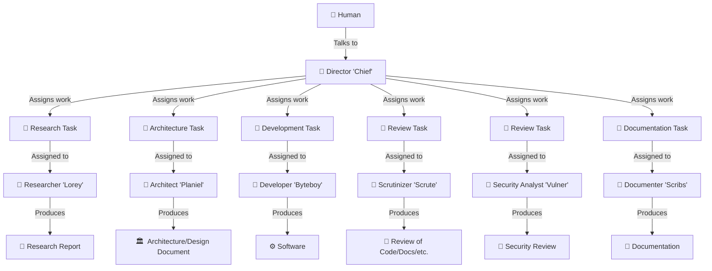

# cobots

This repository contains my AI tooling setup; my agent files, instruction files, and skills.
I've written most of these myself (some with the help of AI).
Others, I've copied and modified to my liking (I've added notes to each of these).
This is primarily intended to be used with GitHub Copilot or other AI-assisted coding agent tools.

The name **cobots** comes from one (or all) of these:

* *Connor's Bots*
* *Coding Bots*
* *Collaborating Bots*
* *Cool Binary Output Technicians*
* *Confusing, overthought, binary-optimizing totality*
* ...alright I'm out of ideas

## The System

So far, the system of agents works like this:

* [The Director](agents/director.cobots.agent.md) ("***Chief***") is the main line of communication to to the human. It seeks to understand the goals of a project/problem and comes up with a high-level plan of what tasks are involved, then delegates work to other agents to complete them.
    * The Director makes use of the [cobots workflow definitions](./instructions/cobots/workflows/), which lay out instructions on how best to structure work and delegate tasks to agents.
* [The Researcher](agents/researcher.cobots.agent.md) ("***Lorey***") researches topics and produces research reports.
* [The Architect](agents/architect.cobots.agent.md) ("***Planiel***") creates comprehensive reports on how a software system should be designed (or how a problem should be solved).
* [The Developer](agents/developer.cobots.agent.md) ("***Byteboy***") implements the architect's design.
* [The Scrutinizer](agents/scrutinizer.cobots.agent.md) ("***Scrute***") reviews the implementation (or anything else requested) and suggests improvements to be made.
* [The Documenter](agents/documenter.cobots.agent.md) ("***Scribs***") writes documentation.
* [The Security Analyst](agents/secanalyst.cobots.agent.md) ("***Vulner***") performs security reviews, and looks for vulnerabilities or other security-related concerns.

### Tracking Work

The following skills are used by the agents to track work and report progress:

* [Cobots Tasks CLI](skills/cobots_tasks/) - A small CLI tool that creates and manages `*.task.md` files under a working directory.
    * Tasks represent individual items that need completing for the project.
    * The bots track their work by:
        * Creating tasks
        * Querying existing tasks
        * Assigning them to each other
        * Updating tasks by adding comments to the file as an ongoing discussion
        * Marking their statuses as "pending", "underway", "complete", etc.
* [Cobots Reports CLI](skills/cobots_reports/) - A small CLI tool that creates `*.report.md` files under a working directory.
    * Reports represent write-ups created by the agents, such as architecture plans, code reviews, etc.
* [Cobots Ntfy CLI](skills/cobots_ntfy/) - A small CLI tool that uses [ntfy.sh](https://ntfy.sh) to send me notifications on agent progress, updates, questions, etc.
    * By default, it is configured to run in "confidential" mode, meaning that only generic messages can be sent via [ntfy.sh](https://ntfy.sh) (such as "build finished", "waiting for input", etc.).

### Monitoring

* [Cobots TUI](skills/cobots_tui/) - An interactive TUI dashboard for the cobots workspace.
    * Provides an interactive Textual TUI (default) and a `--show-overview` flag for a static Rich-formatted snapshot.
    * Humans use the TUI to browse tasks and reports, view/edit items, and monitor workspace activity with auto-refresh.
    * Use `python3 cobots-tui.py --show-overview` for a quick non-interactive snapshot.

### Utility Skills

The following skills provide utility capabilities to agents:

* [Cobots Docparse CLI](skills/cobots_docparse/) - A CLI and library for converting documents (PDF, Office, email, markup, data formats, etc.) into readable Markdown or plain text.
    * Supports 25 file formats via a handler registry built on top of Microsoft's MarkItDown library.
    * Other skills can import `cobots_lib.docparse` for programmatic document conversion.

## Installing

To install these agents, simply run the [`install.sh`](./scripts/install.sh) or [`install.ps1`](./scripts/install.ps1) script.
All agent, instruction, and skill files will be copied to your local `${HOME}/.copilot/` directory.

## Resources

A few useful resources that I've learned from:

* [Awesome GitHub Copilot](https://awesome-copilot.github.com/) - A collection of agents, skills, instructions, etc.
* [How to write a great `agents.md`](https://github.blog/ai-and-ml/github-copilot/how-to-write-a-great-agents-md-lessons-from-over-2500-repositories/)

